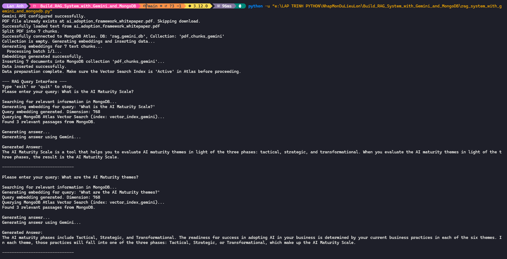

# RAG System with Gemini and MongoDB Atlas

This project implements a Retrieval-Augmented Generation (RAG) system using Google's Gemini for embeddings and text generation, with MongoDB Atlas serving as the vector database for efficient information storage and retrieval.

## Overview

This application can process a PDF document, store its content as vector embeddings in a MongoDB database, and answer user questions based on the document's content. It leverages the powerful capabilities of MongoDB Atlas Vector Search to find relevant context for the Gemini model to generate accurate, context-aware answers.

## How It Works

The workflow is as follows:

1.  **Configuration**: The system loads the necessary credentials (MongoDB URI and Gemini API Key) from a `.env` file.
2.  **PDF Ingestion**: A PDF document is downloaded from a specified URL. The script can be easily modified to use different online PDFs.
3.  **Text Processing**: The text content is extracted from the PDF and split into smaller, coherent chunks or paragraphs.
4.  **Embedding Generation**: Each text chunk is converted into a high-dimensional vector embedding using Google's `embedding-001` model. This is done in batches to handle large documents and respect API rate limits.
5.  **Data Storage**: If the specified MongoDB collection is empty, the system inserts the text chunks along with their corresponding vector embeddings. On subsequent runs, this step is skipped.
6.  **Information Retrieval**: When a user submits a query:
    - The query is first converted into a vector embedding.
    - MongoDB Atlas Vector Search is used to perform a high-speed similarity search, retrieving the text chunks most relevant to the user's query from the database.
7.  **Answer Generation**: The original query and the retrieved passages are compiled into a comprehensive prompt. This prompt is then passed to the `gemini-pro` model to generate a fluent, informative answer based _only_ on the provided context.
8.  **Interactive Q&A**: The system provides a command-line interface, allowing for a continuous question-and-answer session.

## Technologies Used

- **Generative AI**: `google-generativeai` (for Gemini API access)
- **Vector Database**: `mongodb` (for MongoDB Atlas and Vector Search)
- **PDF Processing**: `pypdf`
- **Environment Management**: `python-dotenv`
- **HTTP Requests**: `requests`

## Setup Instructions

Follow these steps to set up and run the project locally.

### Prerequisites

- Python 3.8+
- A free or paid MongoDB Atlas account.
- A Google Cloud project with the Gemini API enabled and an API key.

### 1. Clone the Repository

```bash
git clone https://github.com/dhlananhh/Build_RAG_System_with_Gemini_and_MongoDB.git
cd Build_RAG_System_with_Gemini_and_MongoDB
```

### 2. Install Dependencies

Install the required Python packages from the `requirements.txt` file.

```bash
pip install -r requirements.txt
```

### 3. Set up Environment Variables

Create a `.env` file in the root directory of the project. Add your MongoDB connection string and Gemini API key to this file.

```env
# MongoDB Atlas Connection String
MONGODB_URI="mongodb+srv://<username>:<password>@<cluster-url>/?retryWrites=true&w=majority"

# Google Gemini API Key
GEMINI_API_KEY="YOUR_GEMINI_API_KEY_HERE"

# (Optional) You can also specify the database and collection names
# MONGO_DB_NAME="your_db_name"
# MONGO_COLLECTION_NAME="your_collection_name"
```

Replace the placeholder values with your actual credentials.

### 4. Configure MongoDB Atlas

For this application to work, you must create a **Vector Search Index** on your MongoDB collection.

1.  Navigate to your cluster in the MongoDB Atlas dashboard.
2.  Go to the "Atlas Search" tab.
3.  Under "Vector Search," click "Create Vector Search Index."
4.  Select your desired database and collection, give your index the name `vector_index_gemini`, and use the JSON editor to paste the following index definition:

```json
{
  "fields": [
    {
      "type": "vector",
      "path": "embedding",
      "numDimensions": 768,
      "similarity": "cosine"
    }
  ]
}
```

5.  Click "Create Index" and wait for the index status to become "Active". **This step is mandatory.**

## How to Run

Execute the main script from your terminal:

```bash
python rag_system_with_gemini_and_mongodb.py
```

- On the first run, the script will download the PDF, generate embeddings, and populate your MongoDB collection. This may take a few minutes.
- After the data is set up, the interactive query interface will start.
- Enter your question and press Enter. To exit, type `quit` or `exit`.

## Screenshot

Here's a screenshot of the program running:



## Contributing

1. Fork the repository.
2. Create a new branch:
   ```bash
   git checkout -b feature-name
   ```
3. Make your changes and commit them:
   ```bash
   git commit -m "Add feature-name"
   ```
4. Push to your branch:
   ```bash
   git push origin feature-name
   ```
5. Open a pull request.

## License

This project is licensed under the MIT License. See the [LICENSE](https://github.com/dhlananhh/Build_RAG_System_with_Gemini_and_MongoDB/blob/main/LICENSE) file for details.

---
